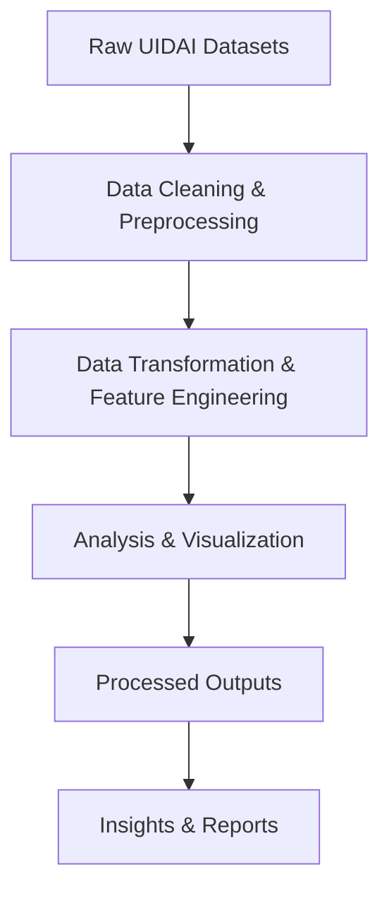

---

# 📊 UIDAI Data Analysis Project

A data-driven analytics project built for the **UIDAI Hackathon 2026**, focused on extracting insights from anonymized Aadhaar enrollment and update datasets.

This repository contains Python scripts and pipelines for cleaning, transforming, analyzing, and visualizing UIDAI datasets to support data-driven decision making.

---

## 🔗 Hackathon Information

Organized by:
**Unique Identification Authority of India (UIDAI)**
In association with **NIC & MeitY**

Official Hackathon Portal:
👉 [https://event.data.gov.in/hackathon_registration/?registration_id=MTA2NTAw](https://event.data.gov.in/hackathon_registration/?registration_id=MTA2NTAw)

---

## 📁 Project Structure

```
UIDAI_Data_Analysis/
├── scripts/                 # Python scripts for data processing & analysis
│   ├── data_cleaning.py
│   ├── transformation.py
│   ├── visualization.py
│   └── uidai_pipeline.py
│
├── outputs/                 # Generated outputs (charts, reports, summaries)
│
├── README.md                # Project documentation
└── requirements.txt        # Python dependencies
```

---

## ⚠️ Important Note on Dataset

The **raw UIDAI datasets are not included** in this repository due to privacy and security policies.

Only registered hackathon participants can download datasets from the official UIDAI hackathon portal.

---

## 🔄 Data Pipeline Workflow



---

## 🧩 Pipeline Description

1. **Raw Datasets**
   Downloaded from UIDAI hackathon portal.

2. **Data Cleaning & Preprocessing**

   * Missing value handling
   * Data validation
   * Format standardization

3. **Data Transformation & Feature Engineering**

   * Feature extraction
   * Aggregations
   * Data normalization

4. **Analysis & Visualization**

   * Statistical summaries
   * Trend analysis
   * Graphs & charts

5. **Processed Outputs**

   * Stored in `outputs/` folder

6. **Insights & Reports**

   * Final observations for presentation and submission

---

## 🛠️ Tech Stack

* **Python**
* Pandas
* NumPy
* Matplotlib
* Seaborn
* OpenPyXL

---

## 💻 Installation & Setup

### 1️⃣ Clone the Repository

```bash
git clone https://github.com/abhini1516/UIDAI_Data_Analysis.git
cd UIDAI_Data_Analysis
```

### 2️⃣ Install Dependencies

```bash
pip install pandas numpy matplotlib seaborn openpyxl
```

### 3️⃣ Run the Pipeline

```bash
python scripts/uidai_pipeline.py
```

All outputs will be saved inside the `outputs/` folder.

---

## 📊 Sample Outputs

* Enrollment trend analysis
* State-wise Aadhaar statistics
* Update request patterns
* Monthly growth charts

(Generated files will be available inside `outputs/`)

---

## 🏆 Hackathon Objective

To leverage UIDAI’s anonymized Aadhaar datasets and build data-driven insights that can help:

* Improve enrollment coverage
* Optimize update processes
* Identify regional trends
* Support policy-level decision making

---

## 🤝 Contribution

This project is maintained for **UIDAI Hackathon 2026**.
Contributions are welcome from registered hackathon participants.

---

## 📄 License

This project is licensed under the **MIT License**.

---

## 📫 Contact

**Abhini S**

* GitHub: [https://github.com/abhini1516](https://github.com/abhini1516)
* LinkedIn: [https://www.linkedin.com/in/abhini-s-220345281/](https://www.linkedin.com/in/abhini-s-220345281/)
* Email: [abhiniprojects7@gmail.com](mailto:abhiniprojects7@gmail.com)

---

### ✅ Important Instructions (Very Important)

When pasting:

✔ Paste directly into `README.md`
❌ Do NOT wrap it inside ```
❌ Do NOT paste inside a code block
✔ Save file and refresh GitHub page

---

